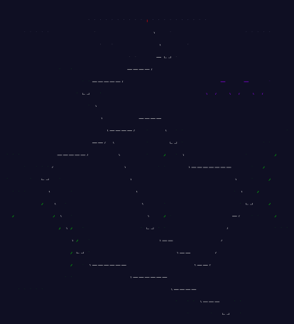

<h1 align="center">🎄 Advent of Code 2020 🎄</h1>
<h6 align="center">by <a href="https://github.com/npanuhin">@npanuhin</a></h6>

    

---

<!-- Solved table start -->
<table>
	<tr>
		<th></th>
		<th align="center">Part 1</th>
		<th align="center">Part 2</th>
	</tr>
	<tr>
		<td><a href="Day%2001">Day 1: Report Repair</a></td>
		<td align="center"><a href="Day%2001/part1.py">⭐</a></td>
		<td align="center"><a href="Day%2001/part2.py">⭐</a></td>
	</tr>
	<tr>
		<td><a href="Day%2002">Day 2: Password Philosophy</a></td>
		<td align="center"><a href="Day%2002/part1.py">⭐</a></td>
		<td align="center"><a href="Day%2002/part2.py">⭐</a></td>
	</tr>
	<tr>
		<td><a href="Day%2003">Day 3: Toboggan Trajectory</a></td>
		<td align="center"><a href="Day%2003/part1.py">⭐</a></td>
		<td align="center"><a href="Day%2003/part2.py">⭐</a></td>
	</tr>
	<tr>
		<td><a href="Day%2004">Day 4: Passport Processing</a></td>
		<td align="center"><a href="Day%2004/part1.py">⭐</a></td>
		<td align="center"><a href="Day%2004/part2.py">⭐</a></td>
	</tr>
	<tr>
		<td><a href="Day%2005">Day 5: Binary Boarding</a></td>
		<td align="center"><a href="Day%2005/part1.py">⭐</a></td>
		<td align="center"><a href="Day%2005/part2.py">⭐</a></td>
	</tr>
	<tr>
		<td><a href="Day%2006">Day 6: Custom Customs</a></td>
		<td align="center"><a href="Day%2006/part1.py">⭐</a></td>
		<td align="center"><a href="Day%2006/part2.py">⭐</a></td>
	</tr>
	<tr>
		<td><a href="Day%2007">Day 7: Handy Haversacks</a></td>
		<td align="center"><a href="Day%2007/part1.py">⭐</a></td>
		<td align="center"><a href="Day%2007/part2.py">⭐</a></td>
	</tr>
	<tr>
		<td><a href="Day%2008">Day 8: Handheld Halting</a></td>
		<td align="center"><a href="Day%2008/part1.py">⭐</a></td>
		<td align="center"><a href="Day%2008/part2.py">⭐</a></td>
	</tr>
	<tr>
		<td><a href="Day%2009">Day 9: Encoding Error</a></td>
		<td align="center"><a href="Day%2009/part1.py">⭐</a></td>
		<td align="center"><a href="Day%2009/part2.py">⭐</a></td>
	</tr>
	<tr>
		<td><a href="Day%2010">Day 10: Adapter Array</a></td>
		<td align="center"><a href="Day%2010/part1.py">⭐</a></td>
		<td align="center"><a href="Day%2010/part2.py">⭐</a></td>
	</tr>
	<tr>
		<td><a href="Day%2011">Day 11: Seating System</a></td>
		<td align="center"><a href="Day%2011/part1.py">⭐</a></td>
		<td align="center"><a href="Day%2011/part2.py">⭐</a></td>
	</tr>
	<tr>
		<td><a href="Day%2012">Day 12: Rain Risk</a></td>
		<td align="center"><a href="Day%2012/part1.py">⭐</a></td>
		<td align="center"><a href="Day%2012/part2.py">⭐</a></td>
	</tr>
	<tr>
		<td>Day 13: Shuttle Search</td>
		<td align="center"><a href="Day%2013/part1.py">⭐</a></td>
		<td align="center"><a href="Day%2013/part2.py">⭐</a></td>
	</tr>
	<tr>
		<td><a href="Day%2014">Day 14: Docking Data</a></td>
		<td align="center"><a href="Day%2014/part1.py">⭐</a></td>
		<td align="center"><a href="Day%2014/part2.py">⭐</a></td>
	</tr>
	<tr>
		<td><a href="Day%2015">Day 15: Rambunctious Recitation</a></td>
		<td align="center"><a href="Day%2015/part1.py">⭐</a></td>
		<td align="center"><a href="Day%2015/part2.py">⭐</a></td>
	</tr>
	<tr>
		<td>Day 16: Ticket Translation</td>
		<td align="center"><a href="Day%2016/part1.py">⭐</a></td>
		<td align="center"><a href="Day%2016/part2.py">⭐</a></td>
	</tr>
	<tr>
		<td>Day 17: Conway Cubes</td>
		<td align="center"><a href="Day%2017/part1.py">⭐</a></td>
		<td align="center"><a href="Day%2017/part2.py">⭐</a></td>
	</tr>
	<tr>
		<td>Day 18: Operation Order</td>
		<td align="center"><a href="Day%2018/part1.py">⭐</a></td>
		<td align="center"><a href="Day%2018/part2.py">⭐</a></td>
	</tr>
	<tr>
		<td>Day 19: Monster Messages</td>
		<td align="center"><a href="Day%2019/part1.py">⭐</a></td>
		<td align="center"><a href="Day%2019/part2.py">⭐</a></td>
	</tr>
	<tr>
		<td>Day 20: Jurassic Jigsaw</td>
		<td align="center"><a href="Day%2020/part1.py">⭐</a></td>
		<td align="center"><a href="Day%2020/part2.py">⭐</a></td>
	</tr>
	<tr>
		<td>Day 21: Allergen Assessment</td>
		<td align="center"><a href="Day%2021/part1.py">⭐</a></td>
		<td align="center"><a href="Day%2021/part2.py">⭐</a></td>
	</tr>
	<tr>
		<td>Day 22: Crab Combat</td>
		<td align="center"><a href="Day%2022/part1.py">⭐</a></td>
		<td align="center"><a href="Day%2022/part2.py">⭐</a></td>
	</tr>
	<tr>
		<td>Day 23: Crab Cups</td>
		<td align="center"><a href="Day%2023/part1.py">⭐</a></td>
		<td align="center"><a href="Day%2023/part2.py">⭐</a></td>
	</tr>
	<tr>
		<td>Day 24: Lobby Layout</td>
		<td align="center"><a href="Day%2024/part1.py">⭐</a></td>
		<td align="center"><a href="Day%2024/part2.py">⭐</a></td>
	</tr>
	<tr>
		<td>Day 25: Combo Breaker</td>
		<td align="center" colspan="2"><a href="Day%2025/part1.py">⭐⭐</a></td>
	</tr>
</table>
<!-- Solved table end -->

<!-- |                                               |                           |                          |
|  Total:                                       |           25/25           |          25/25           | -->
